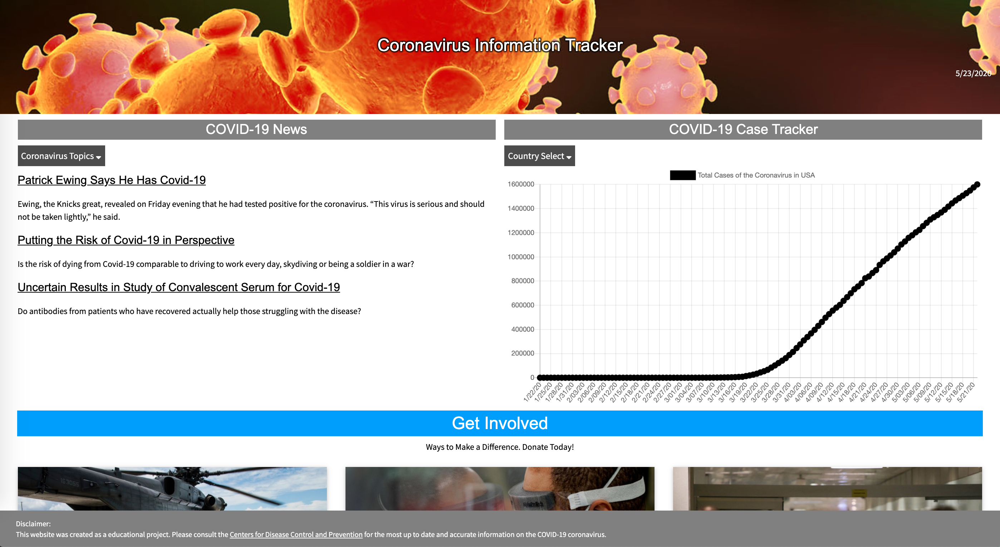

# COVID-19 Info Tracker

Collaborative application built with New York Times Scraper API, the Virus Tracker API, JavaScript, HTML, and CSS. It provides relevant, up-to-date information about the impact and spread of COVID-19. The site aggregates data pertaining to the spread of COVID-19 on a country-by-country basis, as well as, pertinent news articles relating to the disease.

## Questions?

Contact me at smithse4@gmail.com

## Links

* [GitHub Repo](https://github.com/smithse4/covid-19-info-tracker)

* [Deployed Site](https://smithse4.github.io/covid-19-info-tracker/)

## Intended Usage

The intended audience and user-base for this app is anyone that would like a more visual representation of the current progression of the pandemic currently sweeping the nation.

## Installing

To run the app locally, you will first need to git clone the repository to your local machine.

* Cd into repository
* Right-click in index.html and choose 'Open in Default Browser'

## Screenshot of Deployed Site

## Features

- Moment.js powered data-tracker in upper-right corner.
- Mobile-first design through W3 Schools CSS Framework.
- NYT Scraper pulls relevant news articles by keyword, chosen through dropdown to ensure appropriate relevant queries and searches (i.e. no searching for cat stories on the virus tracker website!).
- COVID-19 Case Tracker graph displays up to date information regarding the total number of cases within a single country.
- List of charities displayed at the bottom for those looking to do more to combat the pandemic.

## Credits

© 2019 fanofstuff, SamSherrill, smithse4, jguerra21

